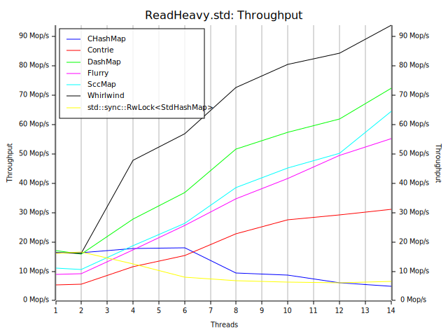
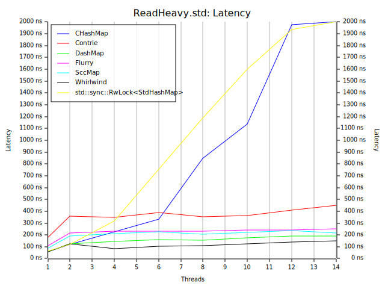
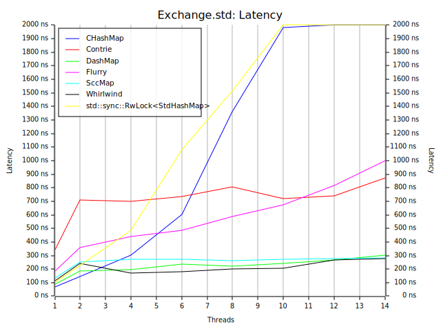
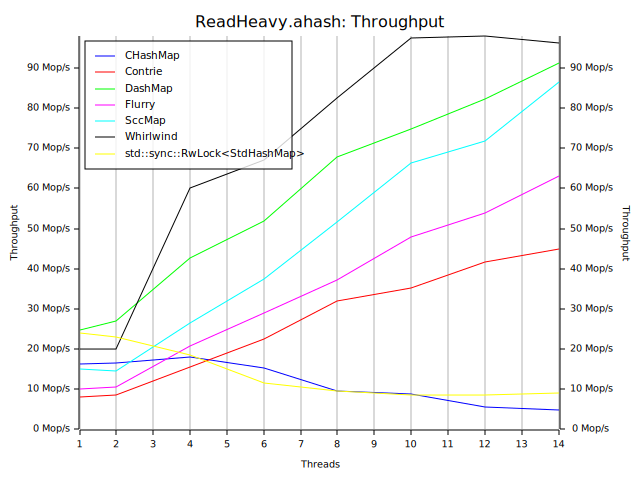
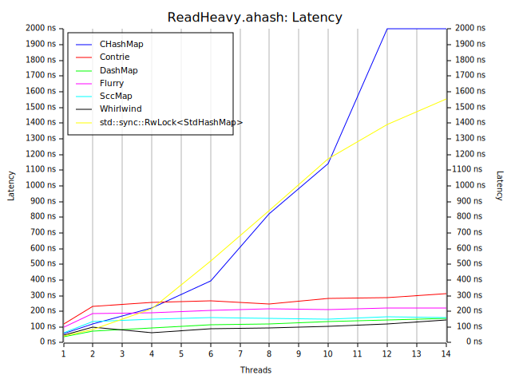
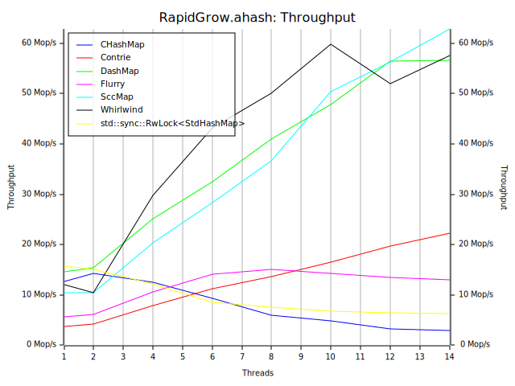
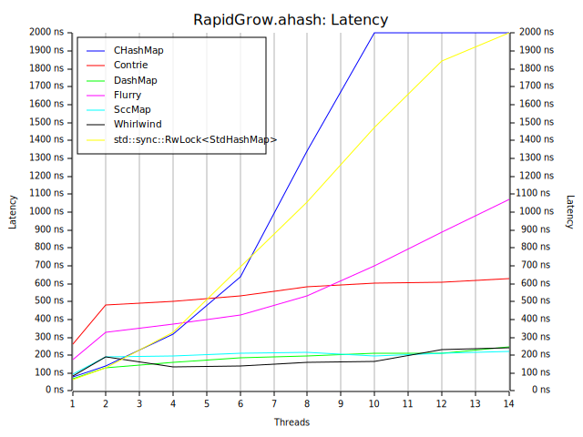

# 🌀 Whirlwind

[](https://github.com/yourusername/shardmap/actions)
[](https://crates.io/crates/whirlwind)
[](https://docs.rs/whirlwind)
[](https://github.com/fortress-build/whirlwind/blob/main/LICENSE)

An asynchronous, sharded `HashMap` for high-performance concurrent data access
in Rust.

> [!NOTE]
> This crate is in development, and breaking changes may be made up until a 1.0 release.

## 📖 Table of Contents

- [Features](#-features)
- [Installation](#-installation)
- [Usage](#-usage)
- [Examples](#-examples)
- [Benchmark](#-benchmarks)
- [Contributing](#-contributing)
- [License](#license)

## ✨ Features

- **Async Ready**: Seamless integration with Rust's `async`/`await` syntax.
- **High Performance**: Sharding minimizes lock contention in concurrent environments.
- **Thread-safe**: Safe for use across multiple threads without fear of data races.
- **Familiar API**: Intuitive `HashMap`-like interface for ease of adoption.
- **Customizable Shards**: Configure the number of shards to optimize for your workload.

## 📦 Installation

Add `whirlwind` to your `Cargo.toml`:

```toml
[dependencies]
whirlwind = "0.1.0"
```

## 🔧 Usage

Here's a quick example to get you started:

```rust
use whirlwind::ShardMap;

#[tokio::main]
async fn main() {
    let map = ShardMap::new();

    map.insert("apple", 3).await;
    map.insert("banana", 5).await;

    if let Some(quantity) = map.get(&"apple").await {
        println!("We have {} apples!", quantity);
    }

    map.remove(&"banana").await;
}
```

## 📚 Examples

### Concurrent Inserts

```rust
use whirlwind::ShardMap;
use tokio::task::JoinSet;

#[tokio::main]
async fn main() {
    let map = ShardMap::new();
    let tasks: JoinSet<_> = (0..1000).map(|i| {
        let map = map.clone();
        tokio::spawn(async move {
            map.insert(i, i * 2).await;
        })
    }).collect();

    tasks.join_all().await.ok();

    assert_eq!(map.len().await, 1000);
}
```

### Custom Shard Count

```rust
use whirlwind::ShardMap;

#[tokio::main]
async fn main() {
    let map = ShardMap::with_shards(64); // Initialize with 64 shards
    // Use the map as needed
}
```

## 📊 Benchmarks

Benchmarks were run in a asyncified version of [this benchmark](https://github.com/xacrimon/conc-map-bench). You can
find it [here](https://github.com/willothy/conc-map-bench). Since the benchmarks use [`jonhoo/bustle`](https://github.com/jonhoo/bustle),
an asyncified fork of that library ([here](https://github.com/willothy/bustle)) is required.

Machine: Apple M3 Max (2023 16-inch MacBook Pro, 36GB RAM)

OS: macOS 15.0

See the `results/` directory.

### Read Heavy (std hasher)

| | |
:-------------------------:|:-------------------------:
 | 

### Exchange (std hasher)

| | |
:-------------------------:|:-------------------------:
 | 

### Rapid Grow (std hasher)

| | |
:-------------------------:|:-------------------------:
 | 

### Read Heavy (ahash)

| | |
:-------------------------:|:-------------------------:
 | 

### Exchange (ahash)

| | |
:-------------------------:|:-------------------------:
 | 

### Rapid Grow (ahash)

| | |
:-------------------------:|:-------------------------:
 | 

## 🤝 Contributing

Contributions are welcome! Please follow these steps:

1. Fork the repository.
2. Create a new branch: `git checkout -b feature/your-feature`.
3. Commit your changes: `git commit -am 'Add your feature'`.
4. Push to the branch: `git push origin feature/your-feature`.
5. Open a pull request.

### Running Tests

Ensure all tests pass before submitting a PR:

```sh
cargo test
```

### Code Style

We use `rustfmt` for code formatting:

```sh
cargo fmt -- --check
```

## License

Copyright 2024 Will Hopkins

Licensed under the Apache License, Version 2.0 (the "License");
you may not use this file except in compliance with the License.
You may obtain a copy of the License at

   <http://www.apache.org/licenses/LICENSE-2.0>

Unless required by applicable law or agreed to in writing, software
distributed under the License is distributed on an "AS IS" BASIS,
WITHOUT WARRANTIES OR CONDITIONS OF ANY KIND, either express or implied.
See the License for the specific language governing permissions and
limitations under the License.

---

Made with 💖 and Rust.
